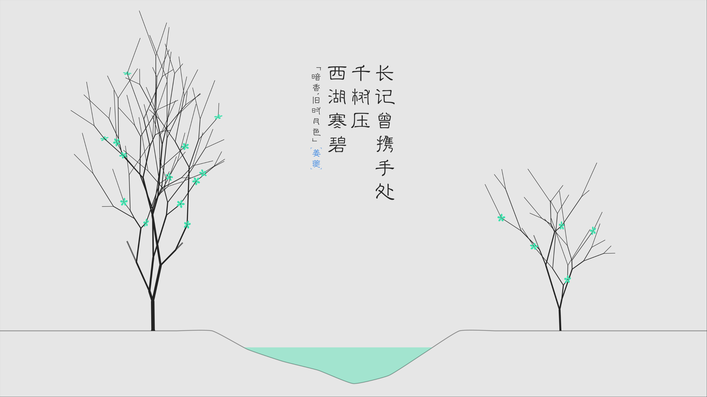

# hypr-shuzhi — Wallpaper Generator for Hyprland

Generate wallpapers featuring Chinese poetry (from jinrishici API) for Arch + Hyprland (Omarchy).
This is port from https://github.com/tuberry/shuzhi, using Claude Code to migrate to Hyprland in less than 15 min.

## Run

```bash
# One-shot generate and set wallpaper
gjs -m src/main.js

# Options
gjs -m src/main.js --light --vertical --sketch wave --font "Serif 48"
gjs -m src/main.js --no-set    # generate only, don't set wallpaper
gjs -m src/main.js --help
```

## Install & Schedule

```bash
bash install.sh
systemctl --user enable --now hypr-shuzhi.timer   # refresh every 30min
```

The refresh interval comes from `updateInterval` in `config.json` (minutes, default `30`). Set it to a
negative number and re-run `install.sh` to disable scheduling entirely — the timer unit is removed instead
of installed. With scheduling disabled, refresh the wallpaper manually with:

```bash
gjs -m ~/.local/share/hypr-shuzhi/src/main.js
```

## Architecture

Standalone GJS application. Ported from tuberry/shuzhi GNOME Shell extension.

### Module Dependency Graph

```
main.js    — Entry point, CLI, wallpaper setting (swaybg + hyprctl)
  ├─ draw.js    — Cairo drawing engine (5 sketch types + text rendering)
  ├─ motto.js   — Fetch poetry from jinrishici API via Soup
  ├─ color.js   — Palette classification (oklch lightness)
  │   └─ colors.js — 690 Chinese traditional color names + RGB
  └─ util.js    — Cascade operators ($, $$, $s, $_), HTTP, polyfills
```

### Wallpaper Pipeline

1. Detect monitor resolution via `hyprctl monitors -j`
2. Fetch motto from `https://v1.jinrishici.com/all.json`
3. Create Cairo ImageSurface at native resolution
4. Paint background → layout motto (Pango) → generate+draw sketch (Cairo) → draw motto
5. Write PNG to `~/.cache/hypr-shuzhi/wallpaper-{dark|light}.png`
6. Update symlink `current/background` (`~/.local/state/omarchy` on Omarchy ≥4.0, `~/.config/omarchy` before that) → notify `omarchy-shell` on ≥4.0, or restart `swaybg` on older versions

### Sketch Types (draw.js)

| Sketch | Themes | Description |
|--------|--------|-------------|
| Wave   | Both   | 5 layered Bezier curves with color palette |
| Blob   | Both   | 19 organic polygons on recursive tile grid |
| Oval   | Both   | 19 rotated/scaled ellipses on tile grid |
| Tree   | Light  | Fractal binary tree with flowers |
| Cloud  | Dark   | Moon phase (date-based) + arc-based clouds |

### Dependencies

- `gjs` (GNOME JavaScript) with GI bindings: Cairo, Pango, PangoCairo, Soup3
- `hyprctl` for monitor detection and process dispatch
- `omarchy-shell` for wallpaper display on Omarchy ≥4.0, or `swaybg` on older versions
- `jq` for reading `config.json` during install
- CJK fonts (e.g., noto-fonts-cjk)

### Courtesy

* https://github.com/tuberry/shuzhi for source logic
* https://github.com/xenv/gushici for Chinese poetry API
